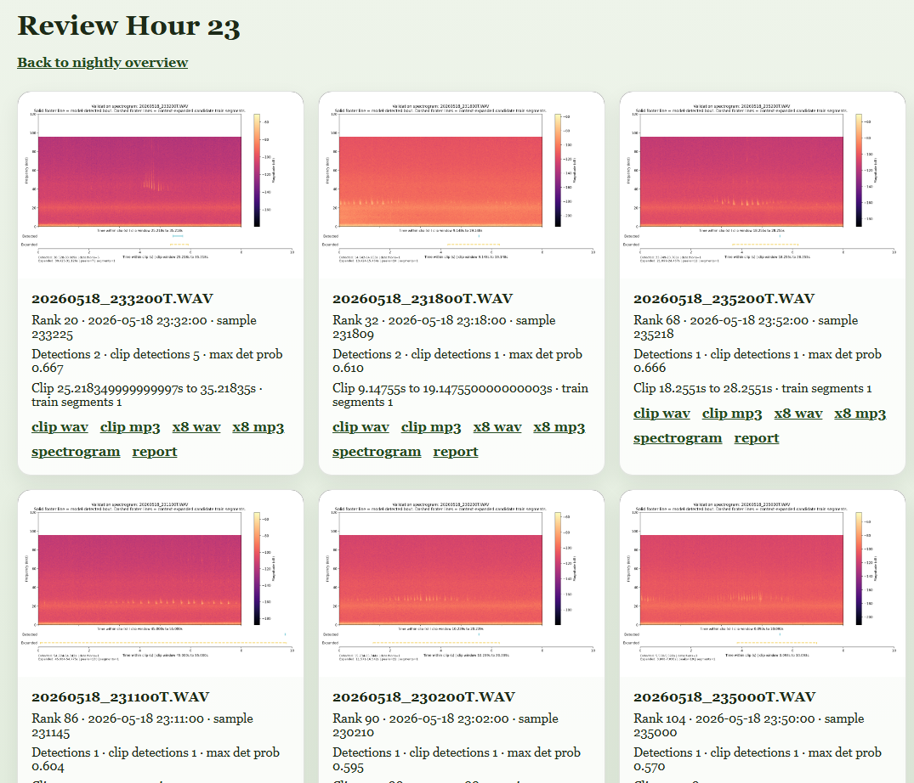
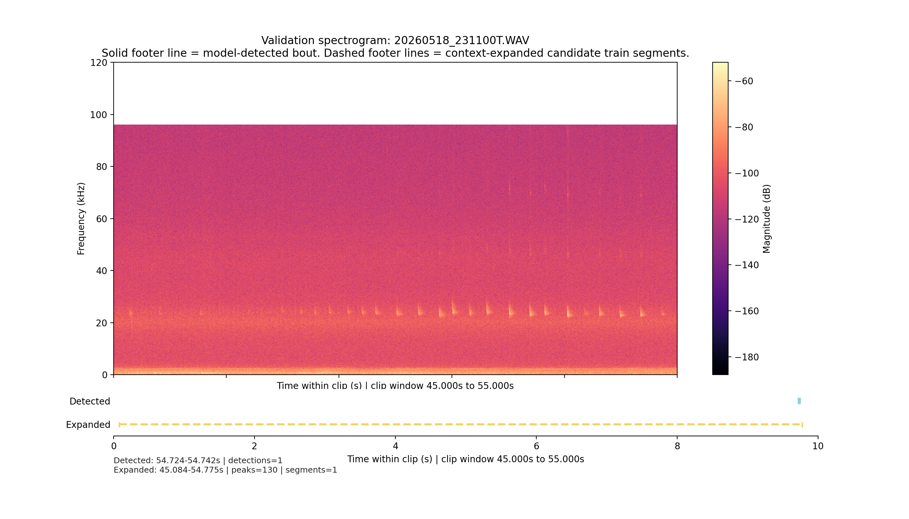

# Bat Chirp

This is an amateur bat-listening project. It uses upstream bat acoustics tools to scan overnight AudioMoth recordings for likely sonar or echolocation signals, then builds review pages so a person can browse the clips, spectrograms, and slowed audio.

The goal is practical screening, not authoritative classification. A strong bat-like detection is treated as a cue to review that recording window more closely. Species labels from upstream models are not treated as trusted local IDs.

## What It Produces

The package currently produces two public-facing outputs that matter most in practice:

- a nightly or hourly review page with ranked detections, spectrogram thumbnails, and direct links to clips and reports
- a per-clip validation spectrogram that overlays the detected bout and the expanded candidate train region used for local review

### Review Page



This is the static review HTML generated for one hour of a night run. Each card shows the recording name, rank, detection counts, clip timing, and direct links to the original clip, slowed audio, spectrogram, and JSON report.

### Validation Spectrogram



This is one exported review spectrogram. The solid footer marker shows the model-detected bout, while the dashed footer span shows the context-expanded candidate train segment that the local review layer inferred around it.

## What This Repo Contains

This repository mainly contains glue code:

- wrappers around BatDetect2 inference and summary output
- review export logic for clips, spectrograms, and HTML pages
- Linux-host scripts for running a full overnight batch
- config handling for local paths and host-specific tools

The intended workflow is simple:

1. Copy AudioMoth WAV files to a Linux machine.
2. Run detection and review export there, ideally with an NVIDIA GPU.
3. Open the generated nightly HTML pages and inspect likely sonar activity.
4. After seeing and hearing sonar in recordings you have (that do not violate laws!), get involved with your local resources.

## What It Is Not

- It is not a species-identification product.
- It is not a replacement for expert review.
- It does not claim ownership of BatDetect2, AudioMoth, or any other upstream project.

## Upstream Projects And Licensing

This repo depends on upstream projects that remain the work of their original authors and maintainers.

- BatDetect2: https://github.com/macaodha/batdetect2
- AudioMoth / Open Acoustic Devices: https://www.openacousticdevices.info/

Nothing in this repository changes, extends, or relicenses those upstream projects. If you install, copy, or redistribute them, you are responsible for following their own licenses, terms, and citation guidance.

More detail is in [docs/upstream-projects.md](docs/upstream-projects.md).

## Running It

Most real runs should happen over SSH on a Linux host where the recordings and GPU live.

Quickstart:
```
git clone https://github.com/jc418gv/bat-chirp.git
cd bat-chirp
./scripts/setup_host.sh
. .venv/bin/activate
which batdetect2
```

Detailed setup, commands, and output descriptions are in [docs/usage.md](docs/usage.md).

The base site config is meant to stay stable. In the normal host setup, it should mainly define `recording_input_dir`, `work_root_dir`, and tool paths. The per-night token such as `20260518` is normally supplied on the command line to [scripts/run_night_for_date.sh](scripts/run_night_for_date.sh), not stored permanently in the JSON file.

Configuration details are in [docs/configuration.md](docs/configuration.md).

## Repo Conventions

- tracked `scripts/` are reusable project entry points
- machine-specific helpers belong under `local/`, which is gitignored
- tracked config should stay generic; personal paths belong in untracked local config files
